# S-Entropy Process Dashboard

The Mogadishu framework includes a real-time process dashboard that generates dynamic Mermaid diagrams showing the current state of the S-entropy bioreactor system as it runs.

## Overview

Instead of traditional dashboard charts and metrics, the system provides process diagrams that update in real-time, showing:

- **System Overview**: Complete S-entropy system state with navigation, cellular networks, and miraculous dynamics
- **Cellular Network**: ATP-constrained cellular observer network with processing efficiency
- **Miraculous Status**: Tri-dimensional miracle dynamics with viability constraints
- **Pipeline Flow**: Processing pipeline status with throughput and bottlenecks

## Usage

### Basic Dashboard Launch

```bash
# Start dashboard on default port 3000
mogadishu-cli dashboard

# Start on custom port with faster updates
mogadishu-cli dashboard --port 8080 --update-interval 500

# Enable auto-refresh and browser opening
mogadishu-cli dashboard --auto-refresh --open-browser
```

### Command Options

- `--port, -p <PORT>`: Server port (default: 3000)
- `--update-interval, -u <MS>`: Update interval in milliseconds (default: 1000)
- `--auto-refresh`: Enable automatic browser refresh
- `--open-browser`: Automatically open browser to dashboard

### PowerShell Demo

Use the provided demo script for quick testing:

```powershell
# Run dashboard demonstration
./examples/dashboard_demo.ps1
```

## Dashboard Interface

The web interface displays four main diagram panels:

### 1. System Overview

```mermaid
graph TB
    SSpaceCurrent["📍 Current S-Position<br/>K:500.0 T:0.100 E:-50.0"]
    CellNetwork["🔬 1000 Active Cells<br/>Avg ATP: 4.2mM"]
    Miracles["✅ Miraculous Dynamics<br/>2 Active Miracles<br/>Global Viability: true"]
    Pipeline["⚙️ Optimization<br/>Throughput: 45.2/sec<br/>3/5 Complete"]
    
    SSpaceCurrent --> CellNetwork
    CellNetwork --> Miracles
    Miracles --> Pipeline
```


### 2. Cellular Network
Shows individual cellular observers with:
- ATP levels (🔋 high, 🪫 low)
- Processing method (⚛️ membrane quantum, 🧬 DNA consultation)
- Efficiency percentages
- Active molecular challenges

### 3. Miraculous Status
Displays miracle levels in each S-dimension:
- **Knowledge**: Normal vs miraculous (🧠⚡)
- **Time**: Normal vs instantaneous (⚡⏰)
- **Entropy**: Normal vs negative generation (❄️⚡)
- **Global Viability**: ✅ viable / ⚠️ violated

### 4. Pipeline Flow
Shows processing stages:
- ✅ Completed stages
- 🔄 Current stage
- ⏳ Pending stages
- 📊 Throughput metrics
- ⚠️ Bottleneck analysis

## Real-Time Updates

The dashboard automatically updates diagrams based on:

1. **System State Changes**: S-space navigation progress
2. **Cellular Activity**: ATP levels, processing efficiency
3. **Miraculous Dynamics**: Miracle activation/deactivation
4. **Pipeline Progress**: Stage transitions and throughput

## Technical Implementation

### Mermaid Diagram Generation

The system uses structured Mermaid diagram generation:

```rust
use mogadishu::visualization::{
    SystemVisualizationState,
    MermaidDiagramGenerator,
    ProcessStateMonitor
};

// Create diagram generator
let generator = MermaidDiagramGenerator::new();

// Update system state
let mut state = SystemVisualizationState::new();
state.update_from_system(&cells, &miraculous_dynamics);

// Generate diagrams
let system_diagram = generator.generate_system_overview(&state);
let cellular_diagram = generator.generate_cellular_network(&state);
let miracle_diagram = generator.generate_miraculous_status(&state);
let pipeline_diagram = generator.generate_pipeline_flow(&state);
```

### State Monitoring

Process state monitoring tracks system evolution:

```rust
use mogadishu::visualization::ProcessStateMonitor;

let mut monitor = ProcessStateMonitor::new(100); // 100 history entries

// Update from system
let changes = monitor.update_from_system(&cells, &miraculous);

// Analyze trends
let trends = monitor.analyze_trends();

// Get performance metrics
let metrics = monitor.latest_metrics();
```

### Web Server

Simple HTTP server serves the dashboard:

- **GET /**: Main dashboard HTML with embedded Mermaid diagrams
- **GET /api/metrics**: JSON API for current system metrics
- Auto-refresh every 1-2 seconds for real-time updates

## Configuration

Dashboard behavior can be customized through configuration:

```rust
use mogadishu::visualization::dashboard::DashboardConfig;

let config = DashboardConfig {
    port: 3000,
    update_interval_ms: 1000,
    auto_refresh: true,
    enable_animations: true,
    diagram_types: vec![
        DiagramType::SystemOverview,
        DiagramType::CellularNetwork,
        DiagramType::MiraculousStatus,
        DiagramType::PipelineFlow,
    ],
};
```

## Use Cases

### Development and Debugging
- Monitor S-entropy navigation progress
- Track cellular processing efficiency
- Debug miraculous dynamics viability
- Identify pipeline bottlenecks

### Demonstration and Presentation
- Real-time visualization of S-entropy concepts
- Live system behavior demonstration
- Process flow explanation
- Performance monitoring

### System Operation
- Production system monitoring
- Performance trend analysis
- Issue identification and diagnosis
- Optimization verification

## Browser Compatibility

The dashboard uses:
- **Mermaid.js** for diagram rendering
- **Standard HTML5/CSS3** for layout
- **Vanilla JavaScript** for auto-refresh
- Works in all modern browsers

## Performance Considerations

- Diagram updates every 1000ms by default
- Minimal server resource usage
- Client-side diagram rendering
- Efficient state change detection
- Configurable update intervals for performance tuning

## Integration

The dashboard integrates seamlessly with:
- **Bioreactor Simulator**: Real system state monitoring
- **CLI Tools**: Command-line dashboard launch
- **Miraculous Dynamics**: Live miracle status tracking
- **Cellular Networks**: ATP and efficiency monitoring
- **S-Entropy Navigation**: Position and progress tracking

Start the dashboard alongside any bioreactor simulation to get real-time process visualization through dynamic Mermaid diagrams.
